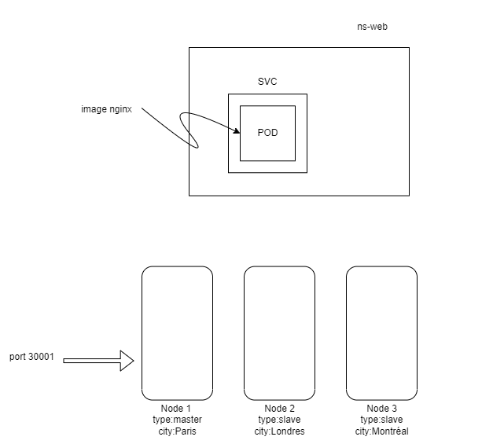
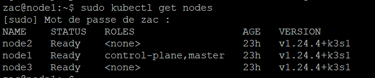
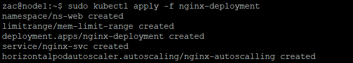
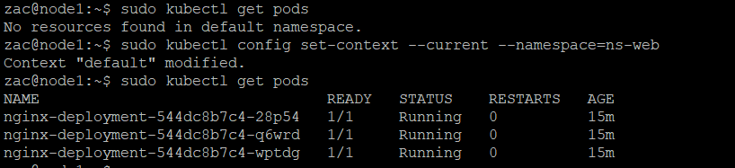
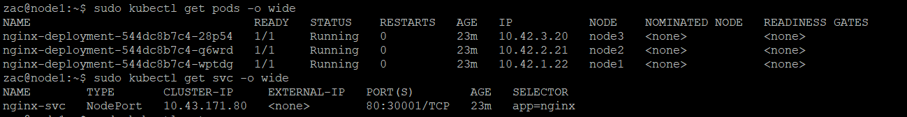
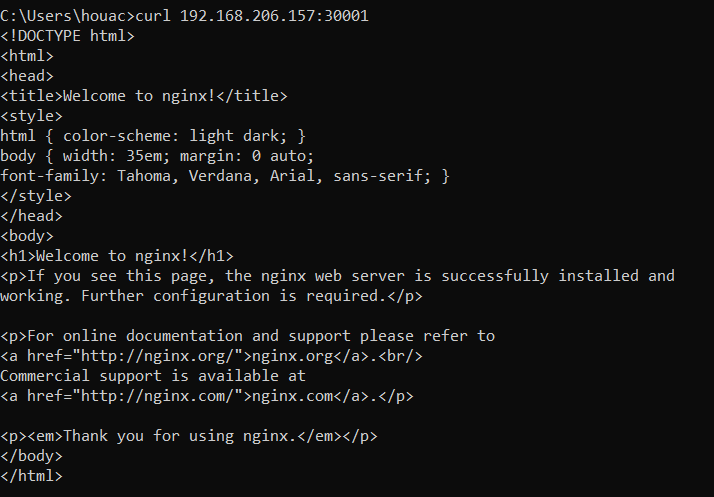
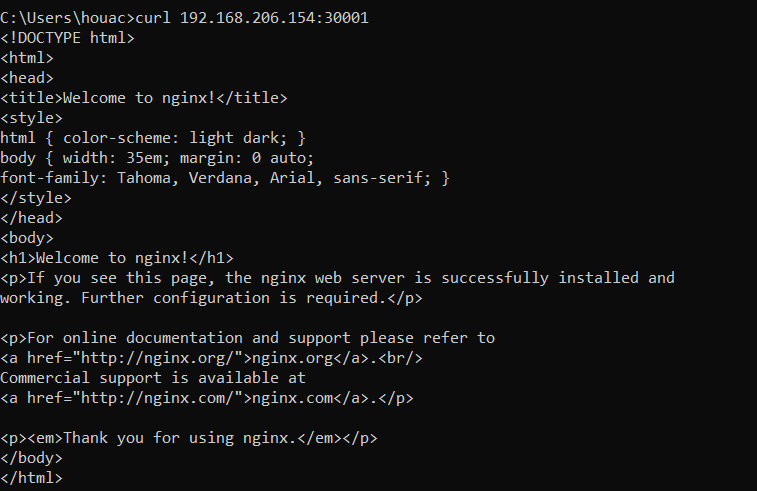
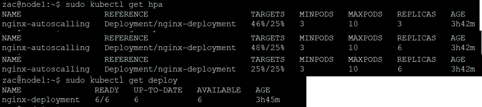
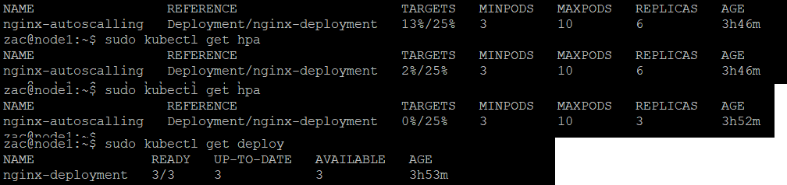

# TP Kubernetes

**Consigne** : Déployer sur un cluster à 3 nodes l’image nginx. Une règle devrait être mise en place afin de repartir le déploiement sur les 3 nodes. Ajouter également une règle d'auto-scaling lorsqu’un pod dépasse 25% d’utilisation de CPU



## _**Création du Cluster avec k3s**_

k3s est une version light de Kubernetes développé par Rancher destiné Proposé, elle est particulièrement adaptée pour l’IOT, le edge computing ou bien les environnements CI/CD. Il s’agit d’un binaire unique ~50Mo nécessitant 512 de RAM.

Premièrement je crée 3 machine virutels Debian 11 qui vont etre mes 3 noeuds.

Ensuite j'installe k3s sur chacun d'eux :

### Sur le Worker
curl -sfL https://get.k3s.io/ | sh - 
cat /var/lib/rancher/k3s/server/node-token

### Sur les slaves
curl -sfL https://get.k3s.io/ | K3S_URL=https://<myserver>:6443 K3S_TOKEN=<mynodetoken> sh -

Une fois k3s installé sur chaque noeud, je  me connecte en ssh sur le master et je fais un "kubectl get nodes" pour verifié si le cluster est bien pret :


## _**Attribution des labels**_

Ensuite j'attribue un label "city" à chaque noeud 

- kubectl label nodes 1 city=Paris
- kubectl label nodes 2 city=Londres
- kubectl label nodes 3 city=Montréal


## _**Déploiement de l'application nginx**_

## Fichier de déploiement
J'ai écris un fichier yaml qui va crée tout les éléments nécessaire aux déploiement de l'application sans devoir passer par la ligne de commande.

le fichier :
- crée d'abord le namespace dans lequel va fonctionné notre application. 
- crée un limit range qui va permettre de dire quels sont les limite de consommation de ressource de notre application.
- déploit nos 3 conteneurs nginx sur nos 3 noeuds, avec une règle d'anti-affinité afin que chaque pods soit déployé sur chaque un noeud différent.
- crée un service pour rendre disponible notre application depuis l'extérieur du cluster
- crée une règle d'auto-scalling pour rendre autonome notre application en terme de consommation de ressources.


```sh
ns-web.yaml

# Création du namespace ns-web

apiVersion: v1
kind: Namespace
metadata:
  name: ns-web
---

# Création d'un limit range pour toutes les pods situés dans le namespace ns-web. Chaque pods sera limité à maximum 512Mi de mémoire et 200m de charge cpu.

apiVersion: v1
kind: LimitRange
metadata:
  name: nginx-limit-range
  namespace: ns-web
spec:
  limits:
  - default:
      memory: 512Mi
      cpu: 200m
    defaultRequest:
      memory: 256Mi
      cpu: 50m
    type: Container
---

# Déploiement d'une application nginx avec 3 pods nginx répartit sur les 3 noeuds, et accessible via le port 80. Une règle d'anti-affinité est crée, elle indique au planificateur d'éviter de placer plusieurs répliques avec l' app=nginx étiquette sur un seul nœud (le label city désigne l'emplacement de chaque noeud). Cela crée chaque pods nginx dans un nœud séparé.

apiVersion: apps/v1
kind: Deployment
metadata:
  name: nginx-deployment
  namespace: ns-web
  labels:
    app: nginx
spec:
  selector:
    matchLabels:
      app: nginx
  replicas: 3
  template:
    metadata:
      labels:
        app: nginx
    spec:
      affinity:
        podAntiAffinity:
          requiredDuringSchedulingIgnoredDuringExecution:
          - labelSelector:
              matchExpressions:
              - key: app
                operator: In
                values:
                - nginx
            topologyKey: "city"
      containers:
      - name: nginx
        image: nginx:latest
        ports:
        - containerPort: 80
---

# Création d'un service de type NodePort, exposant l'application nginx sur chaque noeud du cluster et accessible via le port 30001.

apiVersion: v1
kind: Service
metadata:
  name: nginx-svc
  namespace: ns-web
spec:
  selector:
    app: nginx
  ports:
  - protocol: "TCP"
    nodePort: 30001
    port: 80
  type: NodePort
---

# Création d'une règle d'autoscalling, permettant de limiter la charge CPU de tout les pods à 25%

apiVersion: autoscaling/v1
kind: HorizontalPodAutoscaler
metadata:
  name: nginx-autoscalling
  namespace: ns-web
spec:
  scaleTargetRef:
    apiVersion: apps/v1
    kind: Deployment
    name: nginx-deployment
  minReplicas: 3
  maxReplicas: 10
  targetCPUUtilizationPercentage: 25 
```

## Déploiement ##



## Test et vérification 

Pour pouvoir visualiser les ressources que j'ai déployé sur mon cluster, je doit aller dans le namespace ou je les ais déployés (ns-web).



Les 3 pods sont bien déployés sur chaque noeud et le service qu'il les expose est bien actif : 


On peut y accéder depuis l'extérieur, a partir de l'adresse Ip de chaque noeud en passant par le port 30001 :





## Auto-Scalling

Pour l'auto-scalling je vais déployer une application qui enverra sans cesse des requetes sur mon services pour simuler la montée en charge des pods.

```
$ sudo kubectl run -i --tty load-generator --image=busybox /bin/sh
Hit enter for command prompt 
$ while true; do wget -q -O- http://192.168.206.157:3001; done
```
En augmentant la charge sur les pods, on peut voir que l'autoscalling fonctionne très bien. La charge cpu étant de 48 %, 3 pods supplémentaire vont être crée afin de réduire cette charge à 25 %. Ce qui fait un total de 6 pods actif.


Enfin en arretant la montée en charge, on peut voir que le auto-scalling est aussi bien fonctionnel dans le sens inverse. Le nombre de pods revient à 3 car il n'est plus nécéssaire d'en avoir 6 étant donné que la charge CPU est redescendu à 0%.



